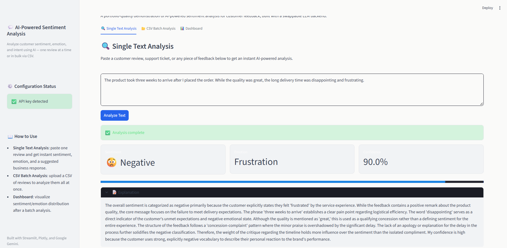
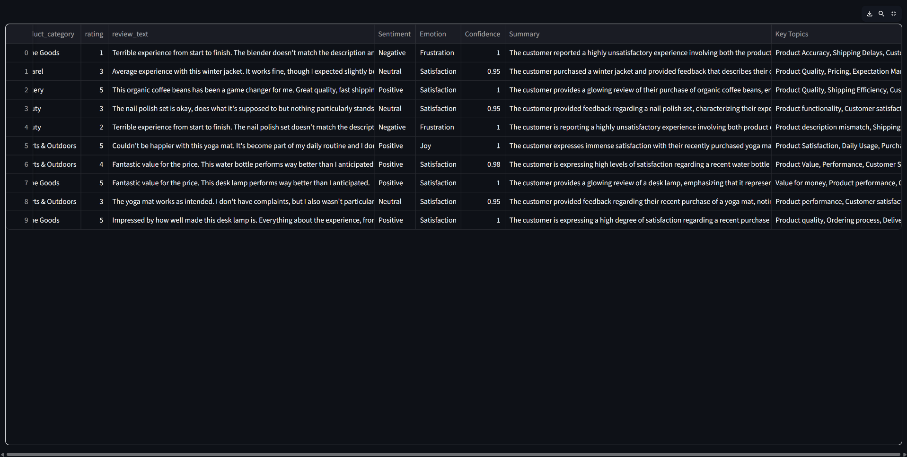
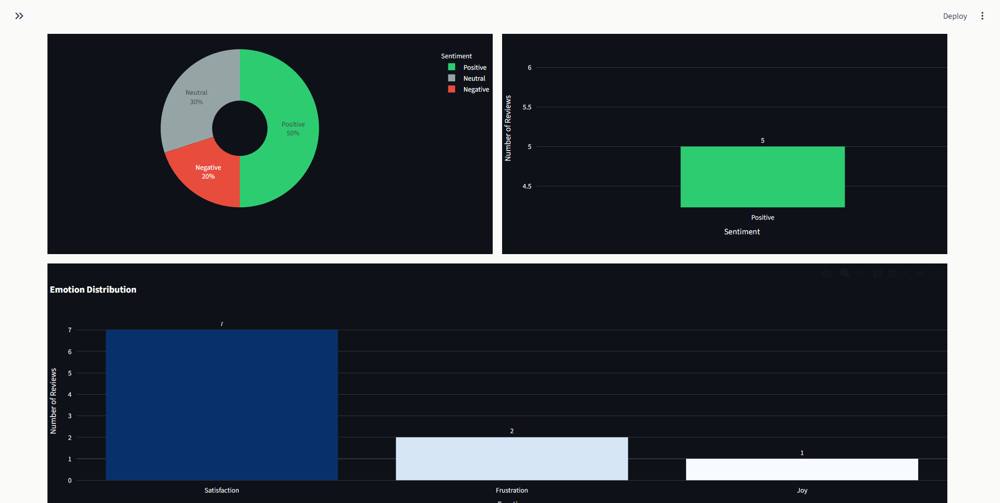

# 💬 AI-Powered Sentiment Analysis

A Streamlit web app that analyzes customer feedback — one review at a time or in bulk via CSV — using Google's Gemini API. It classifies sentiment and emotion, generates a summary and explanation, extracts key topics, and drafts a suggested business response, all visualized in an interactive dashboard.

## ✨ Features

- **Single Text Analysis** — paste any review or feedback and get instant sentiment, emotion, confidence score, a detailed explanation, a summary, key topics, and a suggested business response.
- **CSV Batch Analysis** — upload a CSV of reviews and analyze every row in one run, with a live progress bar and per-row error handling (rows with empty/missing text are skipped rather than failing the whole batch).
- **Interactive Dashboard** — sentiment distribution (pie + bar charts) and emotion frequency, built with Plotly, plus summary metrics (total reviews, % positive/negative/neutral).
- **Downloadable results** — export the fully analyzed CSV with all new columns appended.
- **Resilient by design** — custom exception handling for missing/invalid API keys, rate limits, timeouts, and network failures, so the app never crashes with a raw stack trace.
- **Provider-agnostic architecture** — the AI backend lives entirely behind a `BaseSentimentAnalyzer` interface, so swapping Gemini for another provider (OpenAI, Claude, etc.) only requires changes in `analyzer.py`.

## 🖼️ Preview






## 🛠️ Tech Stack

| Layer | Technology |
|---|---|
| UI / App framework | [Streamlit](https://streamlit.io/) |
| AI provider | [Google Gemini API](https://ai.google.dev/) (`google-genai`) |
| Data handling | [Pandas](https://pandas.pydata.org/) |
| Visualization | [Plotly](https://plotly.com/python/) |
| Config | [python-dotenv](https://pypi.org/project/python-dotenv/) |

## 📁 Project Structure

```
.
├── app.py              # Streamlit UI, session state, and orchestration
├── analyzer.py         # AI abstraction layer (BaseSentimentAnalyzer + Gemini implementation)
├── charts.py           # Pure Plotly chart-building functions for the dashboard
├── utils.py            # Validation, column detection, CSV export, summary stats (no UI/AI deps)
├── .streamlit/
│   └── config.toml     # Light theme configuration
├── .env.example         # Template for required environment variables
└── requirements.txt
```

**Why it's structured this way:** `app.py` never talks to the Gemini SDK directly — it only calls into `analyzer.py`'s public interface. This means the UI, the AI logic, and the charting logic can each be tested, modified, or swapped independently.

## 🚀 Getting Started

### Prerequisites

- Python 3.9+
- A [Google Gemini API key](https://aistudio.google.com/app/apikey)

### Installation

```bash
# Clone the repo
git clone https://github.com/<your-username>/<your-repo>.git
cd <your-repo>

# Create and activate a virtual environment (recommended)
python -m venv venv
source venv/bin/activate      # on Windows: venv\Scripts\activate

# Install dependencies
pip install -r requirements.txt
```

### Configuration

Create a `.env` file in the project root (see `.env.example`):

```
GEMINI_API_KEY=your_api_key_here
AI_PROVIDER=gemini
```

### Run the app

```bash
streamlit run app.py
```

The app will open at `http://localhost:8501`.

## 📊 Using the App

1. **Single Text Analysis** — go to the first tab, paste a review, and click **Analyze Text**.
2. **CSV Batch Analysis** — go to the second tab, upload a CSV (a sample file is provided in `sample_data/`), pick the column containing review text, and click **Analyze CSV**. Download the enriched results when it finishes.
3. **Dashboard** — after running a batch analysis, switch to the third tab to see sentiment/emotion charts and summary metrics.

### Sample data

`sample_data/sample_reviews.csv` contains 100 example customer reviews you can upload directly to test the batch analysis and dashboard without needing your own dataset.

## 🧩 Adding a New AI Provider

The app is designed so that swapping providers touches only `analyzer.py`:

1. Create a new class, e.g. `OpenAISentimentAnalyzer(BaseSentimentAnalyzer)`, implementing `analyze_text()` and `analyze_dataframe()`.
2. Add a branch for it in `get_analyzer()`.
3. Set `AI_PROVIDER` in your `.env` accordingly.

No changes are needed in `app.py`, `charts.py`, or `utils.py`.

## ⚠️ Error Handling

All AI calls are wrapped in a custom exception hierarchy so the UI always shows a friendly, actionable message instead of a crash:

| Exception | Meaning |
|---|---|
| `APIKeyError` | Missing, invalid, or unauthorized API key |
| `RateLimitError` | Provider rate limit or quota reached |
| `AnalysisTimeoutError` | Request took too long to complete |
| `NetworkError` | Could not reach the AI provider |
| `AnalyzerError` | Any other analysis failure (e.g. malformed model response) |

## 🗺️ Roadmap / Ideas

- [ ] Add OpenAI / Claude provider implementations
- [ ] Unit tests for `utils.py` and `analyzer.py`
- [ ] Deploy to Streamlit Community Cloud
- [ ] Add a "% rows skipped" warning banner for batch analysis

## 📄 License

This project is available under the MIT License. See `LICENSE` for details.

## 🙋 About

Built as a portfolio project demonstrating a production-style AI application: clean separation of concerns, a swappable LLM backend, defensive error handling, and an interactive data dashboard.